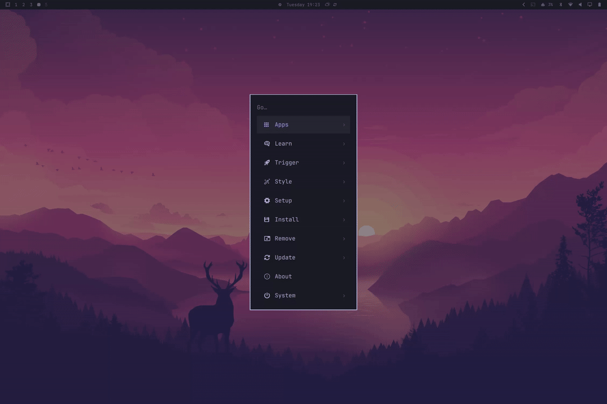

# Omarchy Menu Prefixes

A drop-in replacement for [Omarchy](https://omarchy.org/)'s built-in `Super + Space` menu (`omarchy.menu`) that adds **configurable search prefixes**:

inspired by [omarchy-menu-plus](https://github.com/CarlOscarHMJ/omarchy-menu-plus)



| Type this | What happens |
|-----------|--------------|
| `file:bashrc` | live whole-filesystem file search (via `locate`), opened with the file's default app |
| `g:data pipelines` | searches Google for "data pipelines" in your default browser |
| `yt:lofi beats` | searches YouTube for "lofi beats" in your default browser |
| `=4*23` | inline calculator — Enter copies the result to your clipboard |
| `!100 usd to dkk` | live currency conversion — Enter copies the result |
| `anything else` | normal app/menu search, completely unchanged |

Every prefix — including `file:`, `g:`, `yt:`, `=`, and `!` — is defined in a single JSONC config file. Add your own prefixes for any website or any shell command, with your own icons. Everything else about the menu (apps, settings, power, fonts, dmenu mode, …) is stock `omarchy.menu`.

## Install

```
omarchy plugin add https://github.com/BryonLewis/omarchy-menu-prefixes
```

**This replaces your default Omarchy menu.** The plugin uses the same `clonedFrom` mechanism as `omarchy plugin clone`: enabling it automatically disables the stock `omarchy.menu` and repoints `Super + Space`, the taskbar menu button, and the `omarchy-menu` CLI at this plugin. No keybinding or config changes needed.

### Dependencies

- **`plocate`** — required for `file:` search. Not installed by default on Omarchy:

  ```
  sudo pacman -S plocate
  sudo systemctl enable --now plocate-updatedb.timer
  ```

  Without it, `file:` search just returns no results (nothing breaks).
- `wl-copy`, `curl`, `python-gobject` — standard on an Omarchy install already. `python-gobject` is what resolves a file's default application for `file:` results; without it those rows fall back to plain `xdg-open`.
- **Network access** — currency conversion calls the free [Frankfurter API](https://frankfurter.dev/) (no API key), over HTTPS only.

### Remove

```
omarchy plugin remove com.bryon.omarchy-menu-prefixes
```

Removing (or disabling) it automatically restores the stock `omarchy.menu`.

## Configuration

Optional config file:

```
~/.config/omarchy/extensions/omarchy-menu-prefixes.jsonc
```

The file doesn't need to exist — without it you get the built-in defaults shown below. **Changes apply live** (hot-reloaded on save); no shell restart needed. Missing or invalid entries are ignored, and a broken file falls back to defaults.

### Full schema with defaults

```jsonc
{
  // File search (replaces Omarchy's old ".query" mode from walker).
  "file": {
    "prefix": "file:",        // trigger string; "" disables file search
    "label": "Files",         // unused by the row (rows show file names)
    "fontIcon": "\uf15b",     // Nerd Font glyph for result rows
    "appIcon": "",            // or a theme icon name, e.g. "system-file-manager"
    "maxResults": 60,         // cap shown results (1–500)
    "caseInsensitive": true   // false = case-sensitive locate match
  },

  // Trigger-string → mode map. Keys are the prefixes you type.
  // Set an entry to null to remove it, e.g. "g:": null.
  "prefixes": {
    // kind "web": open the URL in your default browser.
    //   {query} = the search text, URL-encoded.
    "g:": {
      "kind": "web",
      "label": "Google",
      "fontIcon": "\uf1a0",
      "url": "https://www.google.com/search?q={query}"
    },
    "yt:": {
      "kind": "web",
      "label": "YouTube",
      "fontIcon": "\uf167",
      "url": "https://www.youtube.com/results?search_query={query}"
    },

    // kind "cmd": run a shell command with the input.
    //   {query} = the input, shell-quoted (passed as ONE argument)
    //   {raw}   = the input, substituted verbatim (treated as shell code)
    // "t:": { "kind": "cmd", "label": "Terminal", "fontIcon": "\uf489",
    //         "cmd": "kitty -- {query}" },

    // kind "calc": inline calculator.
    "=": { "kind": "calc", "label": "Calculator", "fontIcon": "\uf1ec" },

    // kind "currency": live conversion, e.g. "!420 usd to dkk".
    "!": { "kind": "currency", "label": "Currency", "fontIcon": "\uf155" }
  }
}
```

Notes on the schema:

- Entries merge **per key** over the defaults: `{"prefixes": {"g:": {"fontIcon": "X"}}}` changes only Google's icon, keeping its label and URL.
- When two prefixes could match, the **longest wins** (`gh:` beats `g:` for `gh:omarchy`).
- A prefix needs at least one character after it; `g:` alone falls through to normal menu search.
- Prefixes may be any string: `g:`, `yt:`, `gh:`, `=`, `!`, `ddg:`, `~`, `??` — whatever you like.

### Adding web prefixes

Any site with a search URL works. Find the URL pattern by searching the site once, then replace your query with `{query}`:

```jsonc
{
  "prefixes": {
    "gh:":  { "kind": "web", "label": "GitHub",    "fontIcon": "\uf09b",
              "url": "https://github.com/search?q={query}" },
    "w:":   { "kind": "web", "label": "Wikipedia", "fontIcon": "\uf266",
              "url": "https://en.wikipedia.org/w/index.php?search={query}" },
    "ddg:": { "kind": "web", "label": "DuckDuckGo", "fontIcon": "\uf193",
              "url": "https://duckduckgo.com/?q={query}" },
    "m:":   { "kind": "web", "label": "Maps", "fontIcon": "\uf041",
              "url": "https://www.google.com/maps/search/{query}" }
  }
}
```

Typing `w:hyprland` shows a single row — `Search Wikipedia for "hyprland"` — and Enter opens it in your default browser (via `omarchy launch browser`, which is portal-safe and detaches correctly).

### Adding command prefixes

`kind: "cmd"` runs a shell command with your input. The row shows the expanded command as subtext; Enter runs it (through `bash -lc`, detached from the shell process).

Optional **`rowLabel`** overrides the row text for `web` and `cmd` prefixes. Placeholders: `{label}` (entry label, or the prefix when empty), `{query}`, `{prefix}`. Without it, web rows read `Search Google for "…"` and cmd rows read `Run Terminal`.

```jsonc
{
  "prefixes": {
    // Pass the input as a single argument (safe default):
    //   t:nvim ~/.bashrc  ->  foot --hold nvim '~/.bashrc'
    "t:":  { "kind": "cmd", "label": "Terminal", "fontIcon": "\uf489",
             "cmd": "foot --hold {query}" },

    // Copy the input to the clipboard:
    "cl:": { "kind": "cmd", "label": "Copy", "fontIcon": "\uf0ea",
             "cmd": "wl-copy {query}" },

    // Download a video:
    "dl:": { "kind": "cmd", "label": "Download", "fontIcon": "\uf019",
             "cmd": "xdg-terminal-exec yt-dlp {query}" },

    // Search an Obsidian vault (ob:weather → opens Obsidian's search UI).
    // {query} goes inside the URI; change vault=Personal to your vault name.
    // Note the quoting: the literal part is quoted and {query} supplies its
    // own quotes, so the two join into one argument.
    "ob:": { "kind": "cmd", "label": "Obsidian", "appIcon": "obsidian",
             "rowLabel": "Search {label} for \"{query}\"",
             "cmd": "xdg-open 'obsidian://search?vault=Personal&query='{query}" },

    // Treat the input itself as shell code ({raw} — no quoting):
    //   run:fastfetch  ->  runs fastfetch
    "run:": { "kind": "cmd", "label": "Run", "fontIcon": "\uf054",
              "cmd": "{raw}" }
  }
}
```

Placeholder semantics:

| Placeholder | Substitution | Use for |
|-------------|--------------|---------|
| `{query}` | input, shell-quoted as one argument (`ls -la` → `'ls -la'`) | passing the input to a program |
| `{urlquery}` | input, URL-encoded *then* shell-quoted (`a b&c` → `'a%20b%26c'`) | putting the input inside a URI |
| `{raw}` | input, verbatim | when the input *is* shell code or you need expansion |

Row label placeholders (`rowLabel` on `web`/`cmd` entries):

| Placeholder | Substitution | Use for |
|-------------|--------------|---------|
| `{label}` | entry `label`, or the prefix when `label` is empty | naming the target in the row text |
| `{query}` | the text after the prefix | showing what was typed |
| `{prefix}` | the trigger string (e.g. `ob:`) | rare; mostly for debugging-style rows |

⚠️ **Security:** `cmd` prefixes run arbitrary commands with your user privileges. `{query}` and `{urlquery}` are always quoted so the input can't inject shell syntax, but `{raw}` is not — only add prefixes you trust, and prefer `{query}`.

When building a URI, reach for `{urlquery}` rather than writing your own quotes around `{raw}`. A template like `xdg-open "app://s?q={raw}"` looks safe but isn't: an input containing a double quote closes the one in the template and the rest is parsed as shell code. `{urlquery}` carries its own quoting, so there is nothing to close.

### Icons

Each prefix can use either a **font glyph** or a **system/theme icon**:

| Field | Value | Example |
|-------|-------|---------|
| `fontIcon` | [Nerd Font](https://www.nerdfonts.com/cheat-sheet) glyph | `"\uf1a0"` (Google) |
| `appIcon` | Freedesktop theme icon name (same as a `.desktop` file's `Icon=`) | `"google-chrome"`, `"firefox"`, `"system-file-manager"` |

If both are set, `appIcon` wins. The legacy `"icon"` key is still accepted as an alias for `fontIcon`.

Font glyphs can be written as the literal character or as a `\uXXXX` JSON escape:

- BMP codepoints work directly: `"\uf1a0"` (Google).
- Codepoints above `0xFFFF` need a **surrogate pair**: `"\udb81\udc14"` for `󰈔` (U+F0214).

`label` is shown in the row text (`Search Google for "..."`, `Run Terminal`); override the full row with `rowLabel` (see above). The icon sits at the left of the row.

```jsonc
{
  "prefixes": {
    // Theme icon (looks like a real app icon):
    "g:": {
      "kind": "web",
      "label": "Google",
      "appIcon": "google-chrome",
      "url": "https://www.google.com/search?q={query}"
    },
    // Font glyph (default style):
    "yt:": {
      "kind": "web",
      "label": "YouTube",
      "fontIcon": "\uf167",
      "url": "https://www.youtube.com/results?search_query={query}"
    }
  }
}
```

## Behavior notes

- **File search** queries `locate` with the pattern wrapped as `*query*`, so `file:report*pdf` matches names containing both "report" and "pdf". An exact existing path (absolute, or relative to `$HOME`) is always shown first even if the `plocate` index hasn't caught up. Results open through the bundled `scripts/smart-open.sh`, which bypasses `xdg-desktop-portal` (which can hang for detached processes) and wraps terminal apps in `xdg-terminal-exec` so TUI editors get a real TTY.
- **Calculator** supports `+ - * / % ^` (`**` also works) plus `sqrt`, `cbrt`, `abs`, `pow`, `hypot`, `sin`, `cos`, `tan`, `asin`, `acos`, `atan`, `atan2`, `log`, `log2`, `log10`, `exp`, `floor`, `ceil`, `round`, `trunc`, `sign`, `min`, `max`, `pi`, `e`, and scientific notation (`1e3`). `^` is right-associative and binds looser than unary minus, so `-2^2` is `-4` and `2^3^2` is `512`, the way both read on paper. It is a tokenizer and a parser that computes as it parses — not `eval` behind a filter — so an expression has no reachable path to anything but the arithmetic above.
- **Currency** understands 3-letter ISO codes and the symbols `$ £ € ¥ ₹ ₩` in any position, e.g. `!420 usd to dkk`, `!$420 to dkk`, `!420 EUR to £`. Both source and target currencies are required. The request is pinned to HTTPS (redirects included), times out, and has its response size capped; a rate already on hand is reused instead of refetched.
- **Web prefixes** open in your default browser via `omarchy launch browser` — the same launcher Omarchy's menu uses, so private-window and focus-stealing behavior match.
- Calculator and currency results copy to your clipboard on Enter; web/cmd rows run on Enter; file rows open on Enter.
- Every prefix row except `cmd` is launched as an **argv**, not as a shell command line: the path, URL, or result it carries is handed to the program as a single argument, so nothing that came off the filesystem or the network is ever re-parsed as shell syntax. `cmd` is the deliberate exception — a shell command line is exactly what you configured there.

## Security design

The prefix modes take input from three places the user does not control — the filesystem (`locate` results and the `.desktop` files describing how to open them), the network (exchange rates), and whatever gets typed into the filter. The rules the code follows:

- **Untrusted values travel as argv, never as shell text.** File, web, calculator, and currency rows are launched with an argument vector. The two that still need a shell need it only for a login `PATH` or a pipe, and even then the value arrives as a positional parameter (`"$1"`) rather than being spliced into the script — so no quoting helper sits in the trust path. Same for the `locate` query and the rate URL.
- **`.desktop` files are parsed by the desktop-entry implementation, not by text filters.** `scripts/smart-open.sh` asks GIO for the content type and the registered default application, then either hands the entry to `gio launch` or expands its `Exec=` into an argv under the desktop-entry field-code and quoting rules and `execve`s that. A crafted `Exec=` containing `;`, `|`, `&&`, `$(…)`, or backticks yields inert argv elements, because no shell ever sees it.
- **Every producer has a byte ceiling.** The currency fetch, the file search, and the provider enumerations all end in `head -c`, so a flooding response or script cannot grow a collector without bound. The network fetch is bounded twice (`--max-filesize` for a declared length, `head -c` for a chunked one) and pinned to HTTPS for both the request and any redirect.
- **The calculator is a parser, not a filtered `eval`.** It never builds a string for `Function()`; input length and nesting depth are capped, function arity is checked, and the name allowlist is consulted with own-property lookups so inherited names like `constructor` and `__proto__` cannot reach it.
- **The one deliberate exception is `cmd`.** A `cmd` prefix runs the shell command line you configured, and `{raw}` interpolates your input into it unquoted. That is the feature; prefer `{query}` or `{urlquery}`, which are always quoted.

If you find something here that doesn't hold, please open an issue.

## Troubleshooting

- **`file:` finds nothing** — check that `plocate` is installed and its index exists:
  `pacman -Q plocate && locate bashrc | head`. If the index is missing, run `sudo plocate-updatedb` or enable the timer (see [Install](#install)).
- **A new prefix doesn't appear** — check the JSONC for syntax errors (a trailing comma is fine; a missing quote is not). While the file is invalid, defaults apply.
- **Prefix behaves like normal search** — the prefix needs at least one character after it, and check for typos in the config key (the key *is* the trigger string).
- **Plugin doesn't load at all** — run `omarchy-shell shell rescanPlugins`, then toggle: `omarchy plugin disable com.bryon.omarchy-menu-prefixes && omarchy plugin enable com.bryon.omarchy-menu-prefixes`.
- **Something's broken and you just want the old menu back** — `omarchy plugin remove com.bryon.omarchy-menu-prefixes` restores the stock menu.

## Development

```
git clone <repo> && cd omarchy-menu-prefixes
node --test tests/prefixes.test.js   # unit tests for config/prefix/template logic
omarchy plugin validate .            # manifest/schema validation
```

`PrefixModel.js` is pure JS (no QML) so the config parsing, prefix resolution, and template expansion can be tested with plain `node`. `Menu.qml` is the stock Omarchy menu source with the prefix dispatch layered on top — when Omarchy updates its menu, re-fork from `/usr/share/omarchy/shell/plugins/menu/` and reapply the prefix block (search for "Prefix search modes").

## Credits / license

Fork of Omarchy's built-in `omarchy.menu` plugin (MIT, 37signals) with the prefix system added, inspired by [omarchy-menu-plus](https://github.com/CarlOscarHMJ/omarchy-menu-plus). See [LICENSE](LICENSE).
